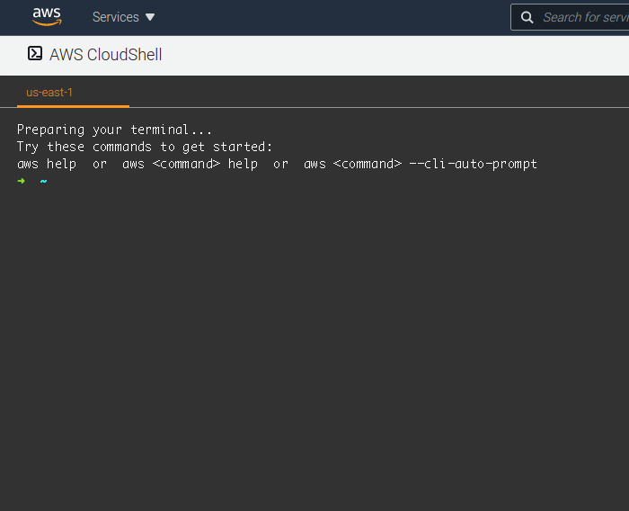

# Install oh-my-zsh in AWS CloudShell

## Why:
- Enables navigable command-line tab completion for enabled commands (i.e. aws cli)
- Shows more info on your prompt (i.e. current git repo)

## Example functionality:



## Install oh-my-zsh
```
# Download oh-my-zsh
sh -c "$(curl -fsSL https://raw.github.com/ohmyzsh/ohmyzsh/master/tools/install.sh)"
# Set zsh to auto-start
echo 'exec /bin/zsh' >> ~/.bash_profile
# Add aws cli to zsh plugins (for tab completion)
sed -i "/^plugins=/c\plugins=(git aws)" ~/.zshrc
# Ask bash to update using this new profile
source ~/.bash_profile
# Exit current session
exit
# Exit one more time to make sure the changes stick
exit
```
